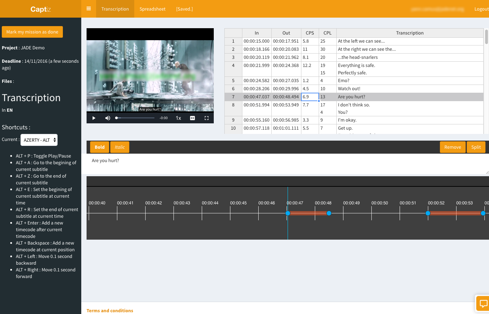

 

# Captiz

Captiz is an online subtitling tool.

You can use it to create a project and invite people to transcribe your video and translate your captions.

With Captiz, our goal is to help your community create better subtitles by following strict guidelines like the number of character per second (CPS) or character per line (CPL).

## Quick Start

Captiz uses Docker to ease the installation process. So first make sure Docker is installed on your system : https://docs.docker.com/engine/installation/

Download the source code, then run :
    
    make
    
It's going to download docker images and start the platform system. You'll end up in a cli in the node.js app folder.

Run the following command to install dependencies and compile SASS (CSS) :

    npm install
    compass compile .
    
To populate the database run :

    node server.js populate
    
Then start your server :

    node server.js
    
You can access the application by going to https://localhost:8001. Default user/password is admin@website.com / admin

Don't forget to set up emails below.

## Configure emails

In order to create a new user or invite someone to create subtitles, you'll need to set up email sending. By default we use [Sendgrid](https://sendgrid.com/) to send emails.

Create and configure your account on sendgrid.com, then go to Settings > API Keys > Create API Key > General API Key > Full Access to Mail Send.

Copy this generated api key in docker-compose.yml in *SENDGRID_API_KEY* variable. You don't need *SENDGRID_TEMPLATE_ID* yet, you can add one later.

Restart the server and you're done.

## Makefile commands

    make start #launch docker images (Mongodb and platform)
    
    make stop
    
    make mongo #connect to the local mongodb cli
    
    make cli #start a command line interface on platform docker image
    
    make #start images + launch platform cli
